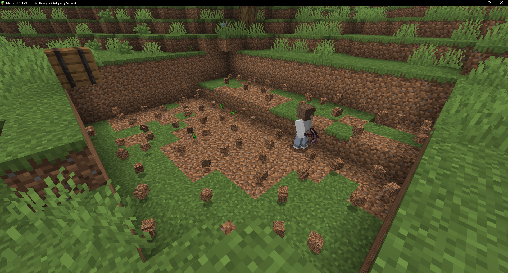
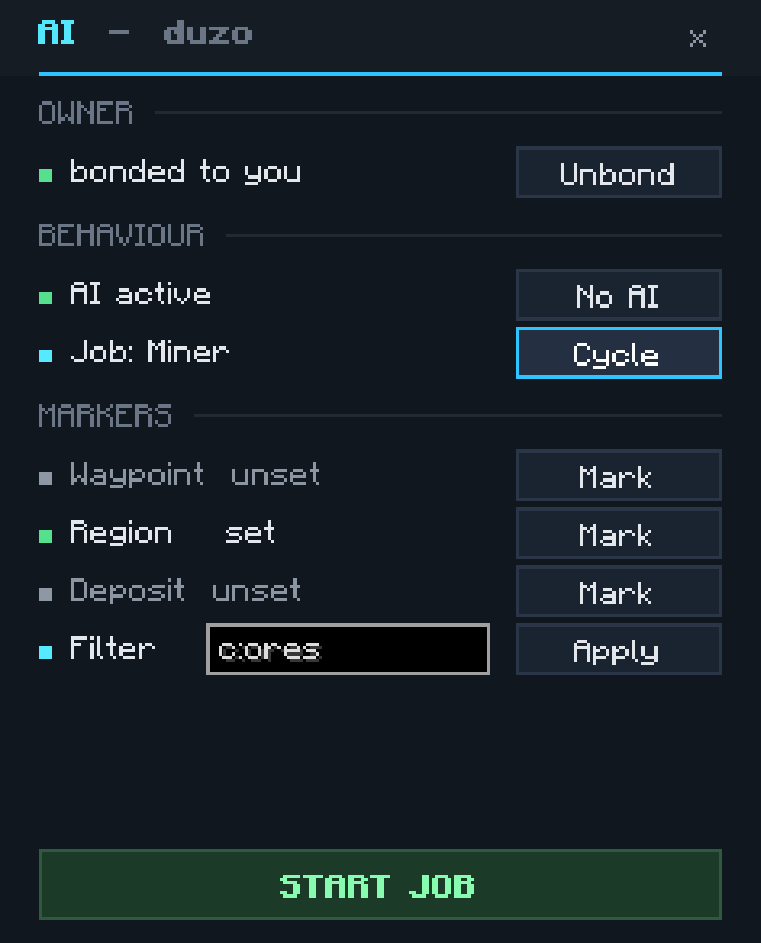
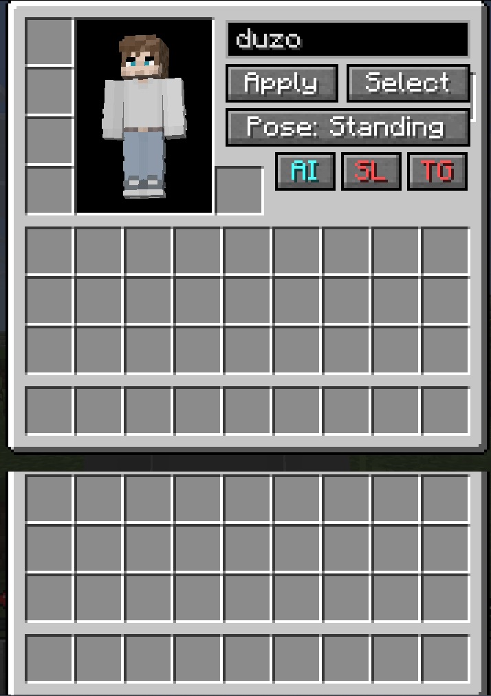
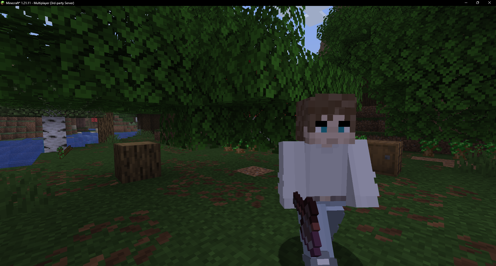
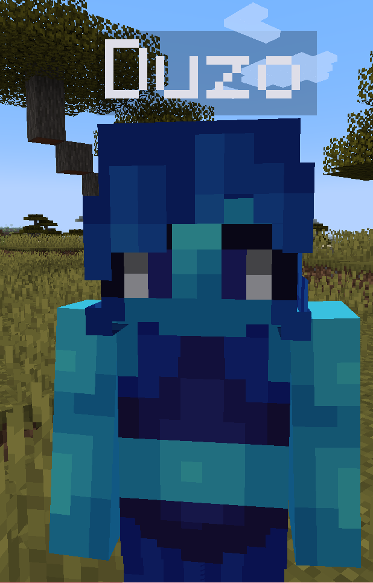
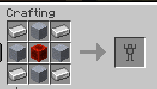
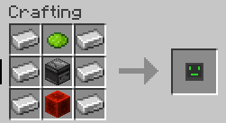
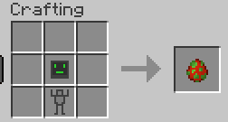

# Fake Players

### Player-like entities that look, work, and live in your world.

Auto-grabbed skins, full inventories, and a complete AI job system - mining, chopping, guarding and hauling, all run by fakes that look exactly like real players.

## 🤖 What is it?

Fake Players adds entities that look **exactly** like real players. They wear armour, hold items, carry an inventory, send chat messages, and - with a name tag - pull the matching skin straight from Mojang. Bond one to yourself, give it a job, and it gets to work.

## 🧍 The Fake Player

| | |
| --- | --- |
| **Looks** | Real player model + auto-grabbed skin (by username, URL, or trending list); slim & classic supported |
| **Acts** | Wanders, sits, sleeps, wears armour, holds items, sends chat, defends itself |
| **Stores** | A full inventory you can manage through its GUI |

**Interactions** - right-click a fake with:

| Item | Does |
| --- | --- |
| Observer | Toggle the fake's AI |
| Name Tag | Set its name + skin |
| Stairs / Beds / Slabs | Sit / sleep / toggle slim skin |
| Eye of Ender | Toggle name-tag visibility |
| Paper | Send a chat message |

## 🧠 AI Jobs

Shift + right-click a fake to open its management GUI, hit **AI**, then **Bond** to yourself and pick a job. Markers (waypoint, region, deposit/source containers) are handed to you as single-use items - right-click to set them. While you hold a marker (or have the GUI open) the fake follows you, so you can set things up on the move.

| Job | Set up | What it does |
| --- | --- | --- |
| **Idle** | (optional) waypoint | Walks to its waypoint, otherwise stands still. |
| **Follow** | bond to you | Follows you within 32 blocks, teleporting if it falls behind. |
| **Guard** | patrol points | Patrols the points you mark and attacks hostiles within range. Hold the Waypoint marker to see every point; right-click adds one, sneak + right-click removes one. |
| **Miner** | region + deposit | Scans the region for ore (item-tag filter, default `c:ores`), mines it, and returns the haul to the deposit container. |
| **Lumberjack** | region (+ deposit) | Fells whole trees, replants saplings and bonemeals to speed regrowth; drops are collected automatically. |
| **Courier** | source + deposit | Shuttles matching items from a source container to the deposit container. |

Job tuning lives in `players.json` (`guardRadius`, `minerMaxBlocksPerSecond`, `minerBailY`, `minerLavaCobbleSafety`, `minerNeverMineBlockUnderFeet`).

<table>
  <tr>
    <td align="center" valign="top"> <b>AI sub-menu</b></td>
    <td align="center" valign="top"> <b>Management GUI</b></td>
  </tr>
  <tr>
    <td align="center" valign="top"> <b>Miner</b> clearing a quarry</td>
    <td align="center" valign="top"> <b>Lumberjack</b> after felling a tree</td>
  </tr>
</table>

## 🎨 Skins

Name a fake with a player's username and it grabs that player's skin automatically, so it always matches.

- **From a URL** - `/players url <entity> <url>`
- **Trending skins** - shift + right-click a fake to browse and apply from the in-game list.
- **Slim & classic** - both model types are supported.

## 🛠️ How do I get one?

Craft a `Robot Shell` and a `Robot AI`, then combine them in a crafting table (or grab a Player Spawn Egg).

&nbsp;&nbsp;

&nbsp;&nbsp;

## 🔗 Links

- [CurseForge](https://www.curseforge.com/minecraft/mc-mods/fake-player)
- [Modrinth](https://modrinth.com/mod/fake-players)
- [Discord](https://discord.gg/ZgssqpUMHS)
- [Showcase video](https://www.youtube.com/watch?v=O5BO6fA41n0)

## 🙏 Credits

- [Jeryn](https://modrinth.com/user/Jeryn/) - for the skin API and downloading code.
