

# Fake Players

### Player look-alikes that mine, chop, guard, and haul - for you.

## 🤖 What is it?

Entities that look **exactly** like real players - auto-grabbed skins, armour, full inventories, the lot. Bond one to yourself, give it a job, and it gets to work.

## 🧍 The Fake Player

- **Looks like a player** - real model with a skin grabbed from any username (or URL / the trending list); slim & classic.
- **Acts like one** - wanders, sits, sleeps, wears armour, holds items, chats, fights back.
- **Carries an inventory** - managed through its GUI.

## 🧠 AI Jobs

Shift + right-click a fake → **AI** → **Bond**, then pick a job. The GUI hands you markers (waypoint, region, chests); right-click to place them - the fake follows you while you do. Each job's menu shows only the markers it needs, and fakes visibly open the chests and barrels they work from.

| Job | Needs | Does |
| --- | --- | --- |
| **Idle** | waypoint (optional) | Walks to its waypoint, else waits. |
| **Follow** | bond | Sticks within 32 blocks, teleports if it lags behind. |
| **Guard** | patrol points | Patrols your points and attacks hostiles in range. Hold the Waypoint marker to edit points - right-click adds, sneak + right-click removes. |
| **Miner** | region + deposit | Strip-mines ore (`c:ores` by default) and banks the haul. Filter grammar and the on/off toggle are covered below. |
| **Lumberjack** | region (+ deposit) | Fells whole trees, replants, bonemeals; auto-collects drops. |
| **Courier** | source + deposit | Hauls matching items from one chest to another. Shares the Miner's filter. |
| **Fisherman** | waypoint + deposit | Sits at the water and casts a real bobber; banks the catch, swaps a fresh rod when one breaks, and uses your rod's enchantments. |
| **Farmer** | region + deposit | Tills a plot, waters it, plants any seed (modded too), bonemeals, then harvests and replants on a loop. |
| **Crafter** | table + source + deposit | Walks to a crafting table and lays out a recipe you teach it by hand; chain it onto another job's chest for a pipeline. |

### Miner / Courier filter

The Miner and Courier both filter what they collect against one stored string, edited from the AI menu's Filter row:

- `<namespace>:<id>` - a specific item or block, e.g. `minecraft:diamond`.
- `#<namespace>:<tag>` - an item or block tag, e.g. `#c:ores`.
- Comma-separated for multiple tokens: `minecraft:diamond,#c:ores`.
- `*`, or a blank box - matches everything. The ON/OFF button next to Apply toggles this directly, and a blank box always means the filter is off (reopening the menu shows it that way too).

Miner defaults to `c:ores` when never set; Courier defaults to matching everything when never set, and the Filter row reflects that per job. Applying a filter does **not** reset quarry progress.

## ⚙️ Config

Tuning lives in `players.json`:

| Key | Default | Effect |
| --- | --- | --- |
| `defaultSkin` | `duzo` | Skin applied to a freshly-placed fake before you rename it. |
| `maxHealth` | `25.0` | Fake player max health. |
| `movementSpeed` | `0.2` | Fake player walk speed. |
| `attackDamage` | `1.0` | Fake player melee damage. |
| `persistFakePlayers` | `true` | Whether fakes survive a server restart. |
| `allowLocalSkinUploadOpOnly` | `true` | Restricts uploading a local skin file to server operators; disable to let any player upload one. |
| `guardRadius` | `12` | How far a Guard chases from its patrol point. |
| `minerMaxBlocksPerSecond` | `2.5` | Caps how fast the Miner can break blocks. |
| `minerBailY` | `-58` | Y level the Miner refuses to dig below. |
| `minerSpoil` | `ground` | What the Miner does with a drop its filter doesn't ask for once the build reserve (up to 64 build blocks) is full: `ground` (dropped and left at the bot's feet - most despawns uncollected), `chest` (deposited like ore), or `void` (deleted). Anything the filter matches is always kept, build-suitable or not. An unrecognised value falls back to `ground` with a logged warning. |

<table>
  <tr>
    <td align="center" valign="top">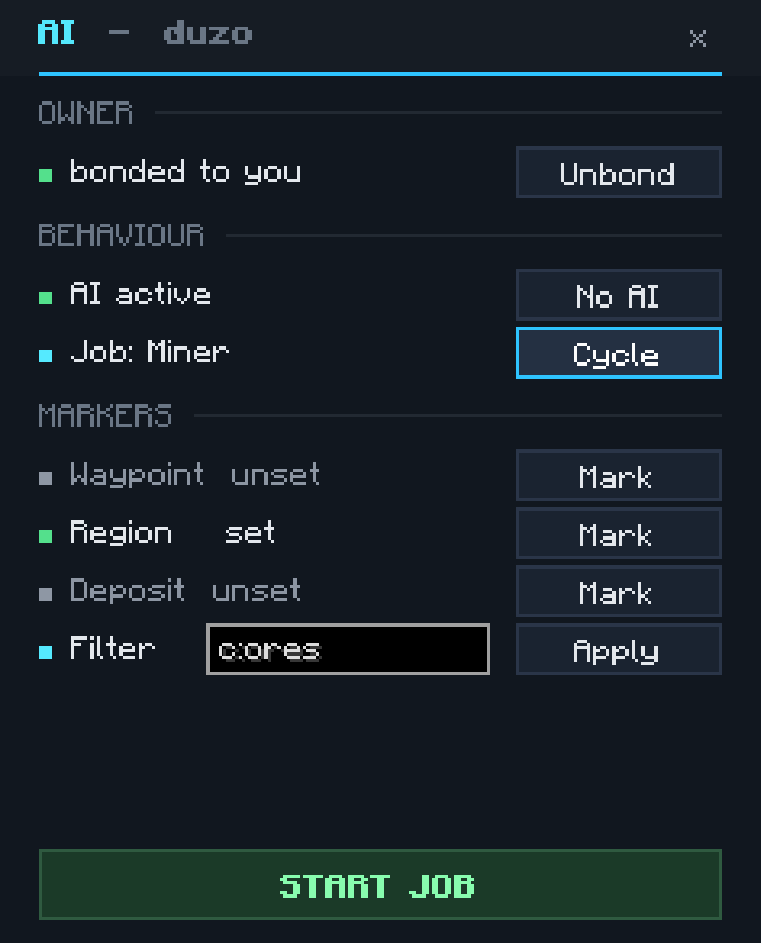 <b>AI sub-menu</b></td>
    <td align="center" valign="top">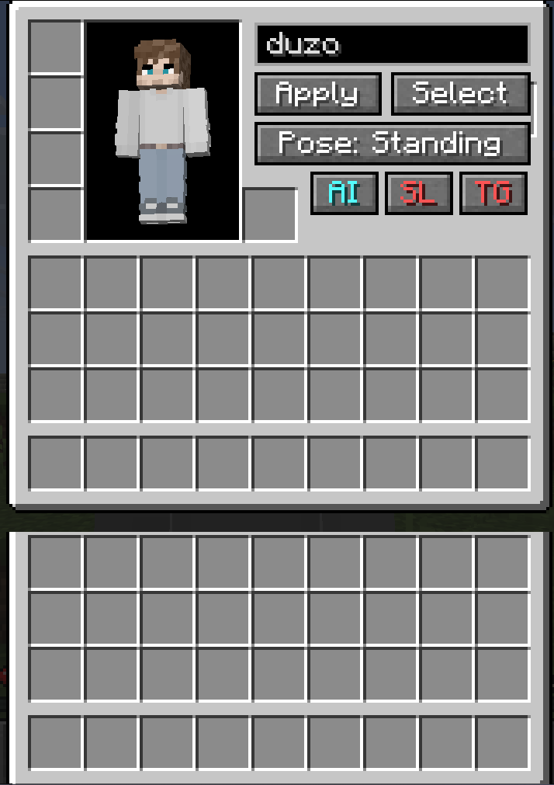 <b>Management GUI</b></td>
  </tr>
  <tr>
    <td align="center" valign="top">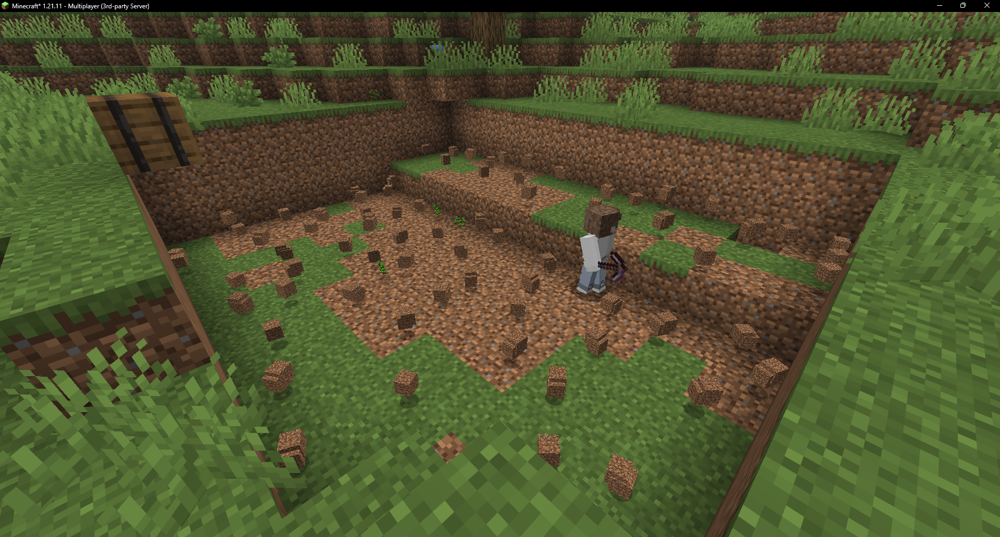 <b>Miner</b> clearing a quarry</td>
    <td align="center" valign="top">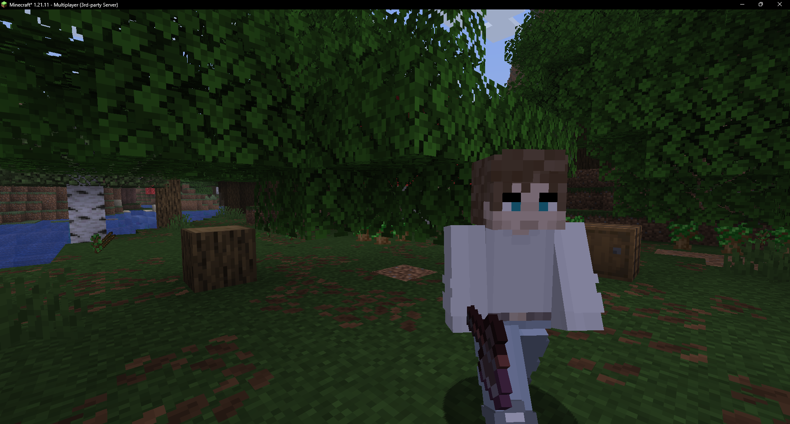 <b>Lumberjack</b> after felling a tree</td>
  </tr>
  <tr>
    <td align="center" valign="top">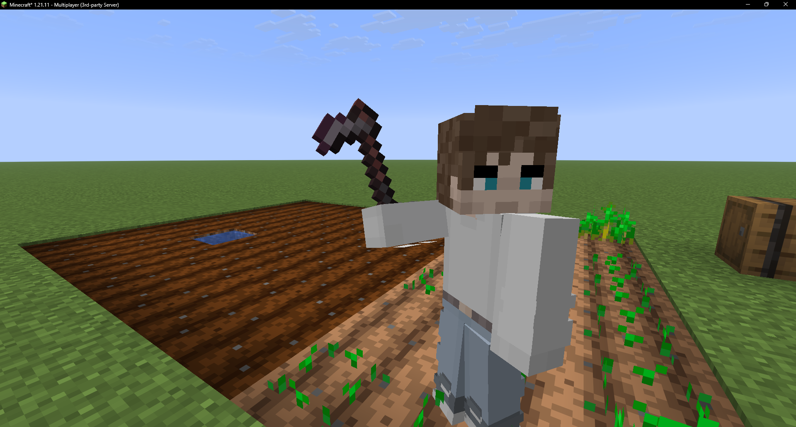 <b>Farmer</b> tending a watered plot</td>
    <td align="center" valign="top">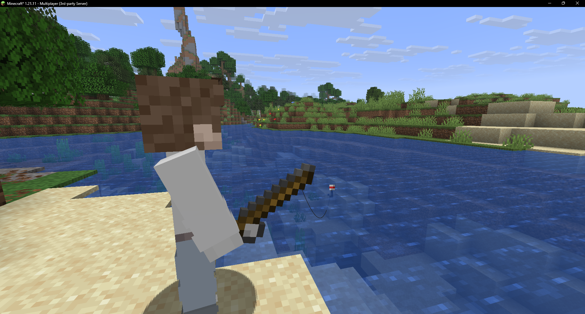 <b>Fisherman</b> casting at the water's edge</td>
  </tr>
  <tr>
    <td align="center" valign="top">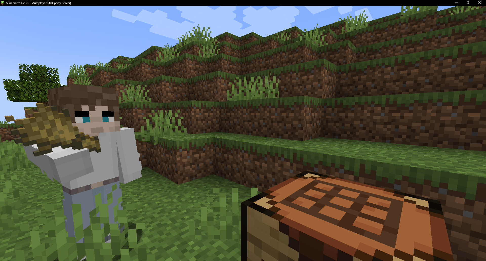 <b>Crafter</b> crafting by hand at its table</td>
  </tr>
</table>

## 🎨 Skins

Name a fake after a player and it wears their skin - always matching. Also:

- **URL** - `/players url <entity> <url>`
- **Trending** - browse and apply from the in-game list (shift + right-click).
- **Slim & classic** both supported.

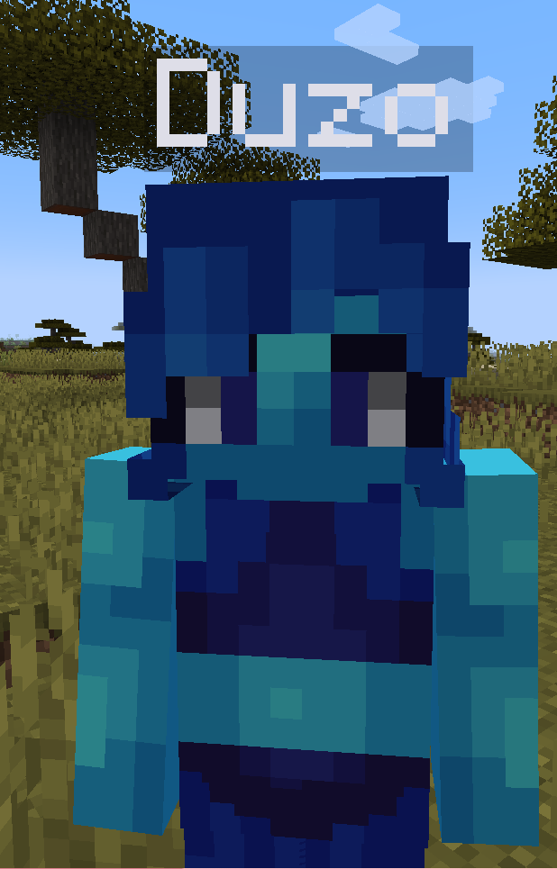

## 🛠️ Get one

Craft a `Robot Shell` and a `Robot AI` and combine them in a crafting table (or use a Player Spawn Egg).

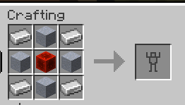
&nbsp;&nbsp;
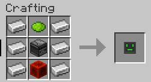
&nbsp;&nbsp;
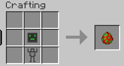

## 🔗 Links

- [CurseForge](https://www.curseforge.com/minecraft/mc-mods/fake-player)
- [Modrinth](https://modrinth.com/mod/fake-players)
- [Discord](https://discord.gg/ZgssqpUMHS)
- [Showcase video](https://www.youtube.com/watch?v=O5BO6fA41n0)

## 🙏 Credits

- [Jeryn](https://modrinth.com/user/Jeryn/) - skin API and downloading code.
